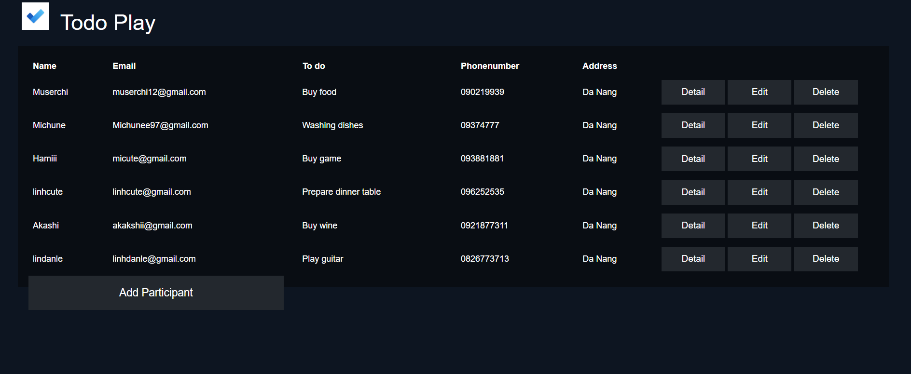

# TODO PLAY APP

# NodeJS TodoPlayApp - NodeJS, Express, Express Ejs

Todo Play App help us manage upcoming tasks, manage the list of participants in the activity, CRUD participants, view details of each participant's to-do

# Usage
There are some screenshots about this app, and the sequence of using the app.

**1. Homepage**

**2. List of participants**

**3. Detail participant page**

**4. Add participants page**

**5. Edit participant page**

